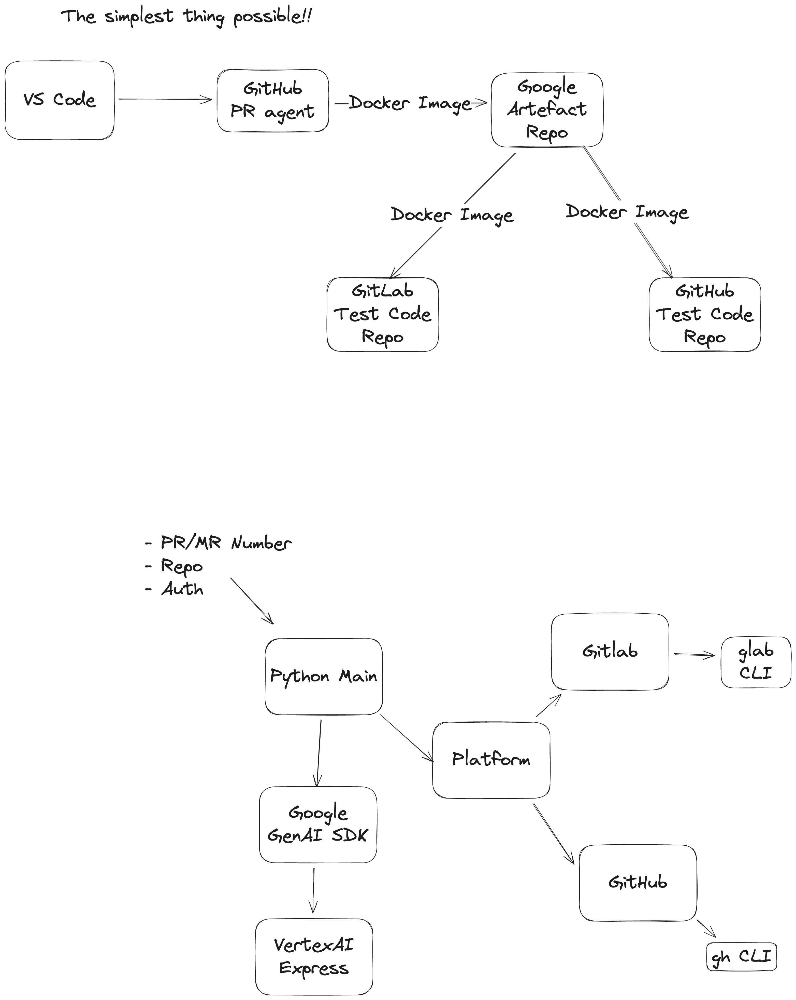

# PR Review Agent (MVP)

A multi-platform PR review agent using Google ADK and Gemini 2.5 Flash to automatically review pull requests and merge requests.

Supports both **GitHub** and **GitLab** through a platform-agnostic architecture.



## Setup

### Prerequisites

1. **Python 3.11+** with virtual environment
2. **Git hosting CLI** (choose based on your platform):
   - **GitHub CLI (`gh`)** - Install from https://cli.github.com/
   - **GitLab CLI (`glab`)** - Install from https://gitlab.com/gitlab-org/cli
3. **Google Cloud SDK** - For Vertex AI authentication
4. **Git platform authentication**:
   - GitHub: Run `gh auth login`
   - GitLab: Run `glab auth login`

### Installation

```bash
# Clone the repository
git clone https://github.com/darkin100/i-am-reviewed.git
cd i-am-reviewed

# Activate virtual environment
source venv/bin/activate

# Install dependencies
pip install -r requirements.txt
```

### Configuration

1. **Copy the example environment file:**
   ```bash
   cp agent/.env.example agent/.env
   ```

2. **Edit `agent/.env` with your settings:**

   For **GitHub**:
   ```bash
   # Google Cloud / Vertex AI
   GOOGLE_CLOUD_PROJECT=your-project-id
   GOOGLE_CLOUD_LOCATION=europe-west2  # or your preferred region

   # GitHub - Update for the PR you want to review
   REPOSITORY=owner/repo               # e.g., "darkin100/i-am-reviewed"
   PR_NUMBER=1                         # PR number to review
   GH_TOKEN=ghp_xxxxxxxxxxxx           # GitHub Personal Access Token
   ```

   For **GitLab**:
   ```bash
   # Google Cloud / Vertex AI
   GOOGLE_CLOUD_PROJECT=your-project-id
   GOOGLE_CLOUD_LOCATION=europe-west2  # or your preferred region

   # GitLab - Update for the MR you want to review
   REPOSITORY=group/project            # e.g., "mygroup/myproject"
   PR_NUMBER=1                         # MR IID to review
   GITLAB_TOKEN=glpat-xxxxxxxxxxxx     # GitLab Personal Access Token
   CI_SERVER_HOST=gitlab.com           # Optional: custom GitLab instance
   ```

3. **Authenticate with Google Cloud:**
   ```bash
   gcloud auth application-default login
   ```

4. **Set authentication tokens:**
   - **GitHub**: Set `GH_TOKEN` in `.env` with a Personal Access Token (PAT) with `repo` scope
   - **GitLab**: Set `GITLAB_TOKEN` in `.env` with a Personal Access Token (PAT) with `api` scope

   **Note**: In CI/CD environments, these tokens are typically provided automatically (`GITHUB_TOKEN` in GitHub Actions, `CI_JOB_TOKEN` in GitLab CI).

## Usage

### Run the PR Review Agent

```bash
# Make sure you're in the project root and venv is activated
source venv/bin/activate

# Run for GitHub
python -m agent.main --provider github

# Or run for GitLab
python -m agent.main --provider gitlab
```

### Test with a Real PR/MR

**For GitHub:**
1. Find a public PR to test with (or create one in your own repo)
2. Update `.env` with the repository, PR number, and token:
   ```bash
   REPOSITORY=facebook/react
   PR_NUMBER=28099
   GH_TOKEN=ghp_your_token_here
   ```
3. Run the agent:
   ```bash
   python -m agent.main --provider github
   ```
4. Check the PR for the review comment

**For GitLab:**
1. Find a public MR to test with (or create one in your own project)
2. Update `.env` with the project path, MR IID, and token:
   ```bash
   REPOSITORY=gitlab-org/gitlab
   PR_NUMBER=100
   GITLAB_TOKEN=glpat_your_token_here
   ```
3. Run the agent:
   ```bash
   python -m agent.main --provider gitlab
   ```
4. Check the MR for the review comment

### Example Output

```
Starting review for PR #123 in owner/repo...
Fetching PR metadata...
Fetching PR diff...
Generating review with AI agent...
Posting review comment to PR...
✓ Review successfully posted to PR #123
View at: https://github.com/owner/repo/pull/123
```
